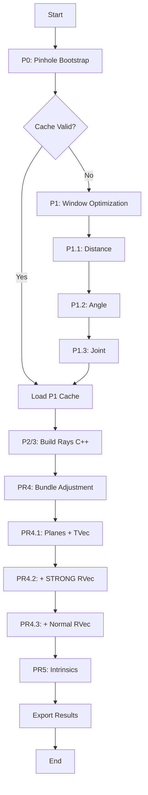

# Refractive Wand Calibration Algorithm Documentation

This document describes the refractive wand calibration algorithm implemented in `refractive_wand_calibrator.py` and `refractive_bundle_adjustment.py`. This calibration is used when cameras observe through refractive interfaces (e.g., glass/acrylic windows into water).

## Overview

The refractive calibrator extends the standard wand calibration to handle **multi-layer refraction** (Air → Glass → Water). It jointly optimizes:
- Camera extrinsics (rotation, translation)
- Camera intrinsics (focal length, principal point, distortion)
- **Window plane parameters** (position and orientation)

> [!IMPORTANT]
> This module requires an **initial pinhole calibration** as a starting point. The refractive optimization refines these parameters while accounting for ray bending at media interfaces.

---

## Optical Model

### Snell's Law at Interfaces
Light rays are traced through three media layers:

```
Camera (Air, n₁=1.0) → Window (Glass, n₂≈1.52) → Tank (Water, n₃≈1.33)
```

At each interface, Snell's Law is applied:
$$n_1 \sin\theta_1 = n_2 \sin\theta_2$$

### Window Plane Parameterization
Each window is defined by:
- **Plane Point** (`plane_pt`): A point on the front surface (mm)
- **Plane Normal** (`plane_n`): Unit normal vector pointing into the tank
- **Thickness** (`thickness`): Glass thickness (mm)
- **Refractive Indices**: `n1` (air), `n2` (glass), `n3` (water)

---

## Algorithm Phases

The calibration proceeds in **5 main phases**:

### Phase 0: Pinhole Bootstrap
**Goal**: Establish initial camera poses using standard pinhole model (ignoring refraction).

#### Step 1: Best Pair Selection
- Scores each camera pair by number of **shared valid frames** (both wand points visible in both cameras).
- Selects the pair with the **highest co-visibility score**.
- This pair defines the initial world coordinate system.

#### Step 2: Primary Pair Initialization
- Uses OpenCV's **8-Point Algorithm** (`findEssentialMat`, `recoverPose`) on the best pair.
- Scales translation using known wand length to establish metric scale.
- **Camera 0** of the pair: Origin (R=I, t=0).
- **Camera 1** of the pair: Relative pose from decomposition.

#### Step 3: Incremental Registration
- Remaining cameras are added one-by-one using **PnP** (`solvePnP`).
- 3D points are triangulated from the already-registered cameras.
- Each new camera's pose is computed relative to these 3D points.

#### Step 4: Primary Pair Optimization (Locked Intrinsics)
- Runs bundle adjustment on the **primary pair only**.
- **Focal length**: Locked to user-provided initial guess (±1 px).
- **Principal point**: Locked to image center.
- **Distortion**: Locked to 0.
- Purpose: Refine geometry without distorting optics.

#### Outputs
- Initial `cam_params` for all cameras.
- Triangulated `X_A`, `X_B` (3D wand endpoints) for all frames.
- Scale established from known wand length.

---

### Phase 1 (P1): Window Plane Optimization
**Goal**: Refine window plane positions and orientations.

#### P1.1: Distance Optimization (1D per window)
- Optimizes only the distance `d` from camera cluster to plane.
- Uses joint triangulation with rays from ALL cameras.

#### P1.2: Angle Optimization (3D per window)
- Optimizes `d`, `α` (tilt), `β` (pan) per window.
- Regularization prevents normals from drifting too far.

#### P1.3: Joint Optimization
- Simultaneously optimizes all window parameters.
- Outer-loop λ adaptation balances ray and length residuals.

**Cost Function**:
$$J = S_{ray} + \lambda \cdot S_{len}$$

Where:
- $S_{ray}$: Sum of squared point-to-ray distances
- $S_{len}$: Sum of squared wand length errors
- $\lambda$: Adaptive weight (target ratio ≈ 1.0)

---

### Phase 2/3: Ray Building
**Goal**: Construct refracted rays using C++ kernel.

- Loads camera files with optimized plane parameters.
- Uses `pyopenlpt.Camera.pinplateLine()` for accurate ray tracing.
- Rays account for all three media layers.

---

### Phase 4 (PR4): Bundle Adjustment
**Goal**: Jointly optimize cameras and planes with rollback protection.

#### Camera Conditioning Classification
Before optimization, each camera's parameters are classified based on geometric conditioning:

| Status | Criteria | Step Cap |
|--------|----------|----------|
| **FREEZE** | Window has only 1 camera (under-constrained) | N/A (not optimized) |
| **OPTIMIZE_STRONG** | Rays are near-parallel to window normal (high refraction sensitivity) | 0.1°/round |
| **OPTIMIZE** | Well-conditioned geometry | 0.5°/round |

**Conditioning Metric**: Angle between optical axis and window normal.
- If angle < 15°: `OPTIMIZE` (well-conditioned, rays nearly perpendicular to glass)
- If angle ≥ 15°: `OPTIMIZE_STRONG` (poorly-conditioned, needs tighter constraints)

#### Freeze Table Structure
```python
freeze_table = {
    window_id: {
        'plane': FreezeStatus,      # Window plane parameters
        'cameras': {
            cam_id: {
                'rvec': FreezeStatus,  # Rotation vector
                'tvec': FreezeStatus,  # Translation vector
                'intrinsics': FreezeStatus
            }
        }
    }
}
```

#### PR4.1: Plane + Selected TVec
- **Planes**: `OPTIMIZE` (all windows with ≥2 cameras)
- **TVec**: `OPTIMIZE_STRONG` for poorly-conditioned cameras only
- **RVec**: `FREEZE` (all cameras)

#### PR4.2: Add STRONG RVec
- **RVec**: `OPTIMIZE_STRONG` for poorly-conditioned cameras
- Uses **tiered rollback** (see below).

#### PR4.3: Add Normal RVec
- **RVec**: `OPTIMIZE` for well-conditioned cameras
- Full extrinsic optimization with step capping.

#### Tiered Rollback Logic (PR4.2/4.3)
| Cost Increase | Action |
|---------------|--------|
| ≤ 1% | Direct Accept |
| 1% - 5% + clamped ≥ 30% | Accept, step_cap *= 0.5 |
| 1% - 5% + clamped < 30% | Accept, λ *= 2 |
| > 5% | Reject, λ *= 2 |

#### Step Capping
- **RVec**: Default 0.5°/round (STRONG: 0.1°)
- **TVec**: Default 5mm/round (STRONG: 1mm)

---

### Phase 5 (PR5): Intrinsic Refinement
**Goal**: Fine-tune focal lengths, distortion, and window thickness.

#### PR5.1: Intrinsics Only
- **Optimized**: `f`, `k1`, `k2` per camera (based on user selection)
- **Fixed**: `rvec`, `tvec`, `cx`, `cy`, window planes, thickness
- Uses prior-based regularization to prevent drift

#### PR5.2: Intrinsics + Thickness
- **Optimized**: `f`, `k1`, `k2` + **window thickness** per window
- **Fixed**: `rvec`, `tvec`, `cx`, `cy`, window plane position/normal
- Thickness is added as optimization variable to compensate for measurement errors

#### Parameter Status
| Parameter | PR5.1 | PR5.2 | Constraint |
|-----------|-------|-------|------------|
| `f` (focal) | OPTIMIZE | OPTIMIZE | Prior-based regularization |
| `k1`, `k2` | OPTIMIZE/FREEZE | OPTIMIZE/FREEZE | Based on user selection |
| `cx`, `cy` | FREEZE | FREEZE | Always locked to image center |
| `rvec`, `tvec` | FREEZE | FREEZE | Extrinsics fixed from PR4 |
| `thickness` | FREEZE | **OPTIMIZE** | Added in PR5.2 |

- Output: Final camera parameters with refined intrinsics.


---

## Residual Structure

The optimizer minimizes a weighted residual vector:

```python
residuals = [
    ray_residuals,           # Point-to-ray distances (pixels)
    sqrt(λ) * len_residuals, # Wand length errors (mm)
    sqrt(λ_reg) * reg_terms  # Regularization (optional)
]
```

---

## Output Format

### Camera Files
Same as standard wand calibration, plus:

```
# Pinplate Param:
# plane on pt: x,y,z
# plane norm vector: nx,ny,nz
# thickness: t
# refraction index: n1,n2,n3
```

### Report JSON
```json
{
  "window_planes": {
    "0": {"plane_pt": [...], "plane_n": [...]}
  },
  "ray_rmse_mm": 0.15,
  "wand_len_rmse_mm": 0.08,
  "final_wand_length_mm": 10.02
}
```

---

## Typical Performance

| Metric | Before Optimization | After Optimization |
|--------|--------------------|--------------------|
| Ray RMSE | 1-3 px | 0.1-0.3 px |
| Wand Length RMSE | 0.5-2 mm | 0.02-0.1 mm |
| Window Normal Drift | - | < 1° |

---

## Key Configuration Parameters

| Parameter | Default | Description |
|-----------|---------|-------------|
| `lambda0_init` | 200.0 | Initial length weight |
| `outer_rounds` | 3 | Lambda adaptation rounds |
| `step_cap_rot_deg_normal` | 0.5 | RVec step limit (normal) |
| `step_cap_rot_deg_weak` | 0.1 | RVec step limit (STRONG) |
| `alpha_beta_bound` | 0.5 | Max tilt/pan (radians) |

---

## Key Dependencies

- `scipy.optimize.least_squares`: Core optimizer
- `pyopenlpt.Camera`: C++ ray tracing kernel
- `numpy`: Linear algebra

---

## Related Files

| File | Purpose |
|------|---------|
| `refractive_wand_calibrator.py` | Main orchestration and caching |
| `refractive_bundle_adjustment.py` | PR4/PR5 optimization |
| `refractive_plane_optimizer.py` | P1 window optimization |
| `refractive_geometry.py` | Ray tracing and triangulation |
| `refractive_bootstrap.py` | Pinhole initialization |

---

## Algorithm Flow Diagram



---

## Author Notes

This module implements a **physically-accurate** refractive calibration pipeline. Key design decisions:

1. **Outer-Loop λ Adaptation**: Prevents Jacobian instability by keeping λ fixed within each `least_squares` call.
2. **Joint Triangulation**: Uses rays from ALL cameras for each 3D point, not just pairs.
3. **Tiered Rollback**: Gracefully handles cost increases by adjusting step size or constraint strength.
4. **C++ Ray Tracing**: Performance-critical Snell's Law calculations are done in C++.
