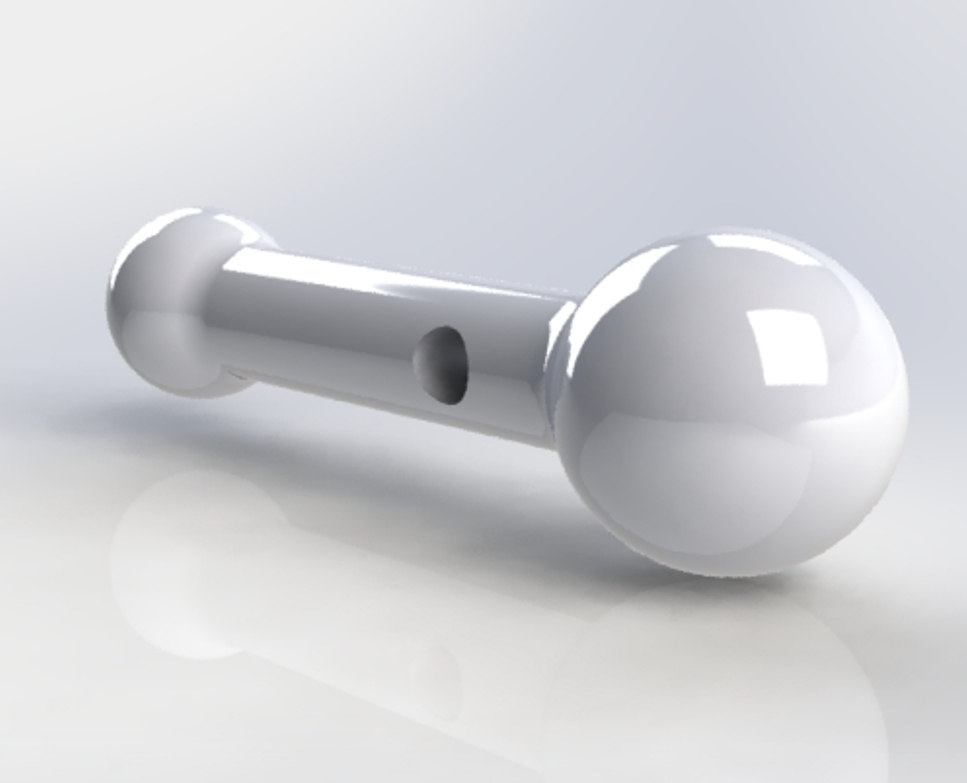
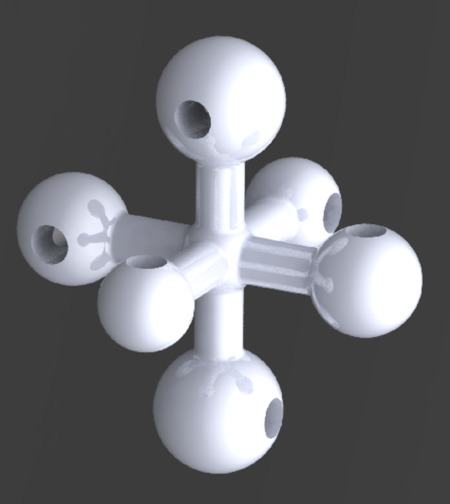
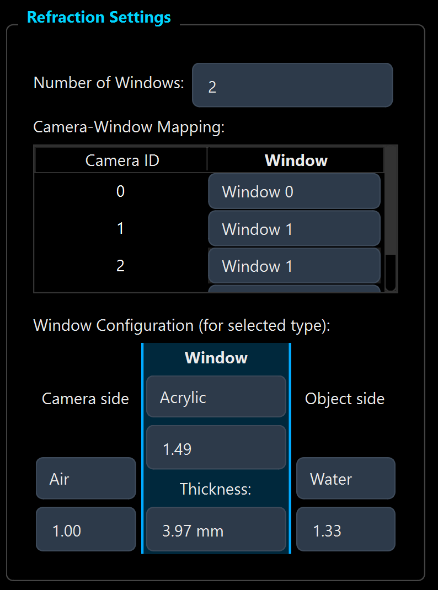

# Wand Calibration User Guide

This guide walks you through the camera calibration process using a calibration wand in OpenLPT. The process consists of three main stages: **Point Detection**, **Axis Points & Coordinate Definition**, and **Calibration**.

## 1. Point Detection

First, select the **Wand Calibration** tab and ensure you are on the **Point Detection** sub-tab.

### Wand Calibrator Target

  

The wand calibrator is a two-endpoint rigid target. During wand calibration, the two endpoint centers are detected in each frame and used with the known wand length constraint.

### Step 1: Configure Settings
Set the detection parameters in the **Detection Settings** panel on the right:
- **Num Cameras**: Enter the number of cameras in your setup (e.g., `2`).
- **Wand Type**: Choose **Dark on Bright** (dark balls on a bright background) or **Bright on Dark**.
- **Radius Range**: Adjust the slider to cover the expected radius (in pixels) of the wand balls in your images (e.g., `45` to `120`).
- **Sensitivity**: Set the detection sensitivity (default is around `0.85`).

### Step 2: Load Camera Images
In the **Camera Images** table:
1.  For each **Cam ID**, load the corresponding folder of calibration images (click the cell or a load button if available).
2.  Enter the initial **Focal Length (px)** (e.g., `9000`).
3.  Enter the detection **Width** and **Height** (e.g., `1280` x `800`).

### Step 3: Verify and Process
1.  Select a frame from the **Frame List**.
2.  Click **Test Detect (Current Frame)**.
    *   *Verification*: Look at the image view on the left. You should see **green circles** identifying the two balls on the wand. If not, adjust the *Radius Range* or *Sensitivity*.
3.  Once satisfied with the detection test, click **Process All Frames / Resume** to detect points in all loaded images.

---

## 2. Axis Points & Coordinate Definition (Optional but Recommended)

If you want a physically meaningful world frame (origin and +X/+Y/+Z directions), define axis points before the final calibration run.

### Axis Calibrator (Endpoint Sizes)

  

Use an axis calibrator with three endpoint-size groups (small, medium, and large), with one opposite endpoint pair per axis.

How the axis-point workflow uses these endpoint sizes:
- The **Detect** step finds circular endpoints and estimates each circle radius in pixels.
- Detected points are grouped into three size bins based on radius ranking.
- In each size bin, the farthest two points are treated as one axis endpoint pair.
- The world-frame **center** is computed as the mean of the three pair midpoints.
- When you select **+X**, **+Y**, and **+Z**, each click snaps to the nearest detected endpoint, and the corresponding pair is used for that axis direction.

### Step 4: Enable Custom Axis Direction
1.  In the **Calibration** sub-tab, locate the **Axis direction** setting.
2.  Switch from **Default** to **Custom**.
3.  A per-camera axis workflow becomes available (axis image loading, detection, and point selection).

### Step 5: Load Axis Images and Detect Candidate Points
1.  For each camera, load one or more axis-reference images (the images that show your axis target).
2.  Click **Detect** to run reliable circle detection on the loaded axis images.
3.  Verify that the detected circles are reasonable before selection.

> **Tip:** If too few circles are detected, adjust **Radius Range** and **Sensitivity**, then run **Detect** again.

### Step 6: Select +X, +Y, +Z for Each Camera and Save
1.  For each camera row, click **Select** and then click points in order: **+X**, **+Y**, **+Z**.
2.  The tool computes **center** automatically from the detected axis pairs.
3.  When all cameras are complete, click **Save** to store axis direction data.
4.  To reuse previous selections, click **Load Axis Points (Optional)** and import the CSV.

### Step 7: Use Axis Points to Define the World Coordinate Frame
1.  Click **Precalibrate to Check** (or run full calibration) after axis points are set.
2.  The system triangulates **center**, **+X**, **+Y**, and **+Z** across cameras and applies world-frame alignment automatically.
3.  Verify in the 3D view:
    - Axis landmarks (center, +X, +Y, +Z) are shown.
    - Dashed lines show measured landmark directions.
    - Solid lines show corrected orthonormal axes used for world coordinates.

---

## 3. Calibration

After extracting points, switch to the **Calibration** sub-tab.

### Pinhole Model Introduction

> [!IMPORTANT]
> **Note on Refracted Interfaces (for Pinhole model):** The pinhole calibration model assumes a homogeneous medium without refractive interfaces. For setups with observation windows (e.g., glass or acrylic), orient cameras as close to the window normal as possible and keep viewing angles small (paraxial condition). If your camera views are nearly normal to the plate, it is still recommended to use the **Pinhole** model.

### Step 8: Calibration Settings
Configure the physical model in **Calibration Settings**:
- **Camera Model**: Select **Pinhole** (standard).
- **Wand Length**: Enter the exact physical distance between the centers of the two wand balls (e.g., `10.00 mm`). **Accurate measurement is critical.**
- **Dist Coeffs**: Number of distortion coefficients to optimize (typically `0` for initial testing, or higher for complex lenses).

### Step 9: Precalibration & Data Cleaning
Before running the full optimization, it is crucial to clean your data to remove outliers (errors in detection).

1.  Click the orange **Precalibrate to Check** button.
2.  The system will perform a fast, global optimization to estimate the error of each frame.
3.  Check the **Error Analysis** table:
    - High **Reprojection Errors** (red) indicate bad detections.
    - High **Length Errors** indicate points that don't match the physical wand length.
4.  **Visual Verification**:
    - Click on any cell in the table (e.g., a high error value).
    - Look at the **Left View**: It will show the original camera image overlaid with the detected points (green circles).
    - Check if the detection is correct. If the system detected a reflection or noise instead of a wand, click the checkbox in the **Del** column to mark it for removal.
5.  **Iterative Cleaning**:
    - Use the filter buttons (e.g., "Delete when proj error > X") or manual Del checkboxes to exclude bad frames.
    - Click **Precalibrate to Check** AGAIN.
    - Repeat until errors are low (e.g., < 1.0 px).

### Step 10: Run Full Calibration
1.  Click the blue **Run Calibration** button.
2.  The system will perform the final Bundle Adjustment (BA) with 4-stage optimization (Geometry Init → Intrinsics → Triangulation → Final Tune).
3.  The **3D View** on the left will visualize the optimized camera positions and wand points.

### Step 11: Final Analysis
Review the final results in the **Error Analysis** table:
- **Reprojection Error**: Should be very low (e.g., < 0.5 px).
- **Length Error**: Should be close to 0.

> **Stopping & Refining:** If the process takes too long or results look wrong, click the **Stop** button to get partial results. If errors are still high, perform another round of cleaning (Step 9) or adjust the *Wand Length* setting.

### Step 12: Save Results
When the "Calibration Successful" message appears, your parameters are ready. You can save the intrinsic and extrinsic parameters to file for use in tracking.

---

## 4. Calibration Model: Pinhole + Refraction

Use this model when refractive interfaces are non-negligible and you need to model camera-side medium, window material/thickness, and object-side medium explicitly.

  

### Step 13: Select the Refraction Model
1. In **Calibration Settings**, set **Camera Model** to **Pinhole+Refraction**.
2. Enter a valid **Wand Length** and the number of **Dist Coeffs**.

### Step 14: Configure Refraction Settings
1. Set **Number of Windows**.
2. In **Camera-Window Mapping**, assign each camera to its corresponding window.
3. In **Window Configuration**, set media/material parameters for each layer:
   - **Camera side** (e.g., Air, refractive index)
   - **Window** (material index and thickness)
   - **Object side** (e.g., Water, refractive index)

### Step 15: Run and Refine
1. Click **Precalibrate to Check** for data cleaning and outlier removal.
2. Iterate filtering based on error metrics.
3. Click **Run Calibration** for final optimization with refraction enabled.

### Step 16: Refraction Model Notes
- It is highly recommended to use **2 or more cameras per refraction plate/window** for better calibration robustness.
- If your camera viewing angle is nearly normal to the refraction plate, it is still recommended to use the **Pinhole** model.
